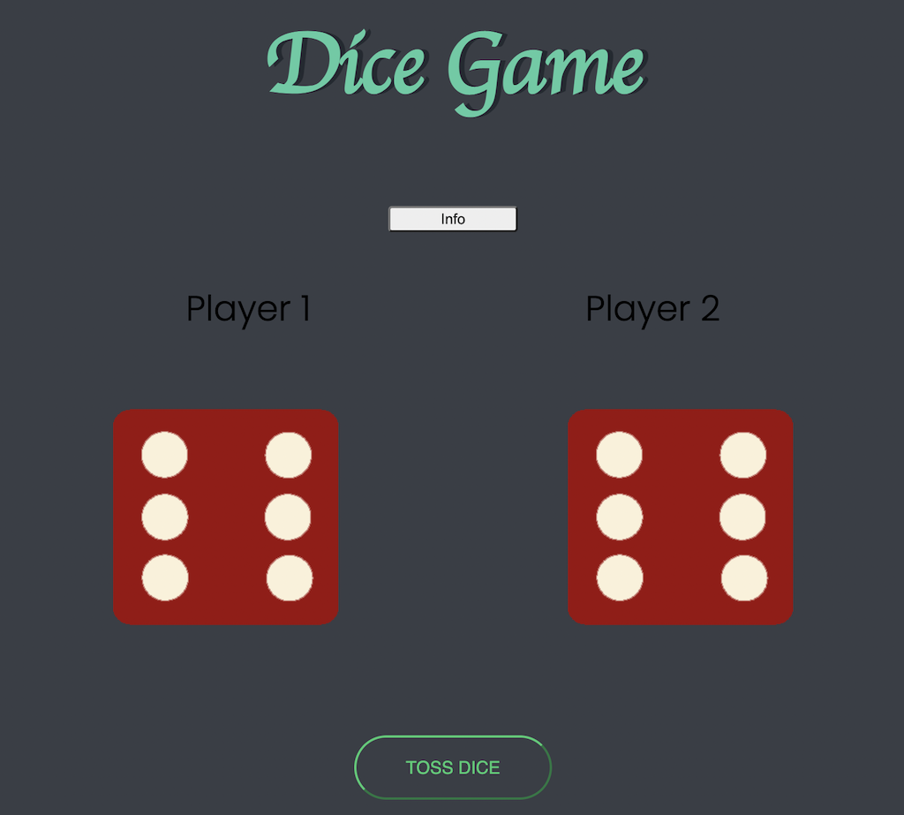

# A Game of Dice

This is a solution to the [Dicee Challenge](https://www.appbrewery.co) from The App Brewery.

## Table of contents

- [Overview](#overview)
    - [The challenge](#the-challenge)
    - [Screenshot](#screenshot)
- [My process](#my-process)
    - [Built with](#built-with)
    - [Continued development](#continued-development)

## Overview

### The challenge

Users should be able to:

- Have dice show result on page refresh
- See the declaration of who won the game

What I added:

- A button to click for rolling dice instead of page refresh
- A game info section hidden until revealed on click

### Screenshot

## My process

### Built with

- Semantic HTML5 markup
- CSS3
- Javascript

### Continued development

- Working with flexbox for web page layout
- Exercising JS logic and mastering DOM manipulation
